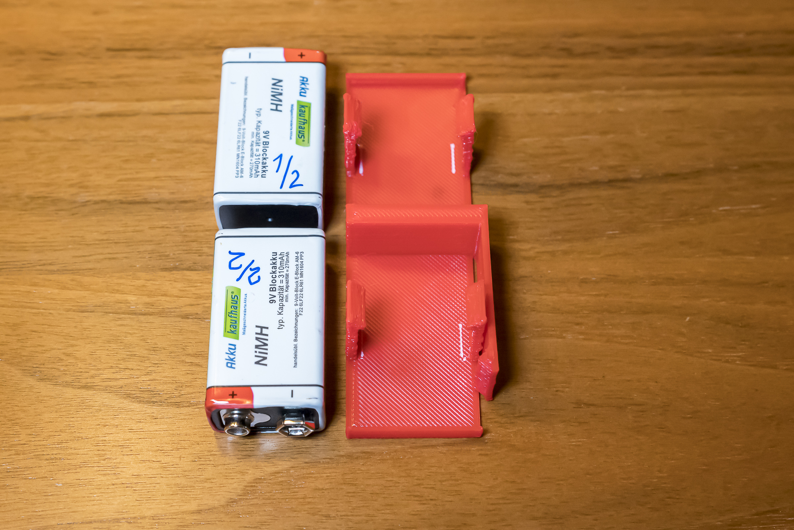

# Sorting parts for DeLock Cable tester bag
Sorting parts for DeLock Cable-tester bag (STL File, created with Rhino 6) 

## Parts
I have a DeLock cable tester with some adapters to connect cables. 
The problem was, all parts are lying around in the bag 
and sometimes prevent you from closing the bag.

Therefore I designed some sorting parts. The bag looks tidy now. 
I have sorting parts for different Rj45 Adapters, 9V Battery, Wires.

## Requirements:
* 3D printer 
* Filament of your choice

## View
 
 
 
 
 
 
 
 
 
 
 
 
 

